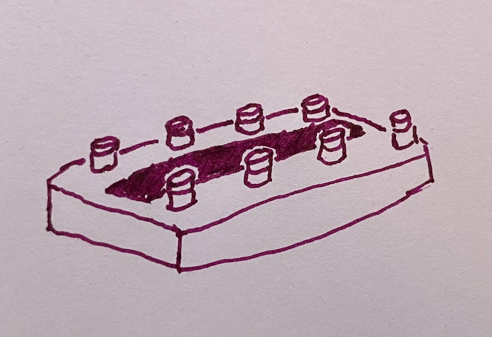

# midilord



MIDI controller pedal built on ESP32-S3.

## Hardware

- 8 footswitches
- 4×40 character LCD (ST7066U, 4-bit parallel)
- 1 MIDI IN, multiple MIDI OUTs
- USB MIDI (native ESP32-S3 USB OTG port)
- 9V pedal power, regulated to 5V and 3.3V logic

### LCD pinout (XNY4004A, 18-pin)

| Pin | Function |
|-----|----------|
| 1 | DB0 |
| 2 | DB1 |
| 3 | DB2 |
| 4 | DB3 |
| 5 | DB4 |
| 6 | DB5 |
| 7 | DB6 |
| 8 | DB7 |
| 9 | E1 |
| 10 | R/W |
| 11 | RS |
| 12 | Vo (contrast) |
| 13 | VSS (GND) |
| 14 | VDD (+5V) |
| 15 | E2 |
| 16 | NC |
| 17 | Backlight + |
| 18 | Backlight - |

## Planned features

- Morningstar-inspired function set
- Presets and banks (16 banks × 8 presets)
- Tap tempo
- Web server for preset and config editing


[LCD Datasheet](https://www.crystalfontz.com/products/document/931/CFAH4004A-YYH-JTDatasheetRelease2021-11-03.pdf)
[APA106](https://cdn.sparkfun.com/datasheets/Components/LED/COM-12877.pdf)

```
x0123456789012345678901234567890123456789
0 [Preset]  [Preset]  [Preset]  [Preset]
1
2
3 [Preset]  [Preset]  [Preset]  [Preset]
```
